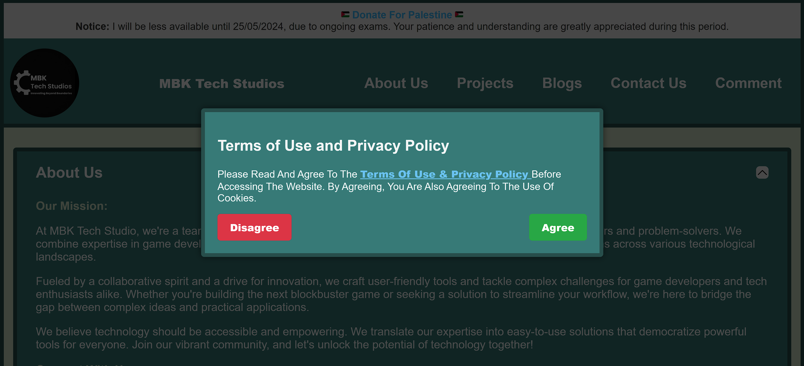

# Mbk Tech Studio Website

Main Website

https://github.com/MIbnEKhalid.github.io/Muhammad-Ibn-E-Khalid.github.io

https://mbktechstudio.com/ or https://MIbnEKhalid.github.io/

Website Source Code / Copy of Website

https://github.com/MIbnEKhalid.github.io/mbktech.studios/

https://MIbnEKhalid.github.io.github.io/mbktech.studios/ or https://mbktechstudio.com/mbktech.studios/

## Hosting:
- The website is hosted on GitHub, with a custom domain purchased from Namecheap for $13 for a 12-month period. This custom domain is pointed to the GitHub repository.
  *Note: If you are using a custom domain, ensure it is properly configured to point to your GitHub repository.*
- Buying domain is not necessary you can use github gomain for free *user.github.io*.

## Files Tree:

### root/:
- Assets/
- Project/
- Project_Category/
- UserAgreement/
- 404.html
- CNAME
- index.html
- README.md

### Assets/: 
- Images/
- disagree.html
- footer.html 
- header.html 
- terms.html
- style.css
- Ostyle.css
- script.js

### Project/:
- Feedback_Report_System_For_Unity.html/: 
  - index.html
- Quiz_Game_Cpp.html/: 
  - index.html
- project.css

### Project_Category/:
- index.html

### UserAgreement/:
- index.html

*Note: To ensure clean and user-friendly URLs, HTML files are organized within directories named after their respective content, with each directory containing an `index.html` file. This approach facilitates clean URLs, enhancing readability and SEO performance.*

#### Example:

Instead of using `UserAgreement.html`:
- Bad URL: [https://mbktech.xyz/UserAgreement.html](https://mbktech.xyz/UserAgreement.html)

Use `UserAgreement/index.html`:
  - Good URL: [https://mbktech.xyz/UserAgreement/](https://mbktech.xyz/UserAgreement/)

## Functionality of Our Website:

- **On First Load, Agreement Prompt:**
  - Upon the initial loading of the website, users are prompted to agree with the terms of use.
  - Users cannot proceed to use the website until they accept the terms of use.

- **Accepting Terms of Use:**
  - When a user agrees to the terms of use, the website saves a cookie with an expiry of 1 year.
  - This cookie likely serves as a marker that the user has agreed to the terms and can continue to access the website without being prompted again during this period.

- **Rejecting Terms of Use:**
  - If a user rejects the terms of use, the website loads a disagreement page.
  - After a few seconds, the website redirects the user to google.com.
  - This behavior implies that users who do not agree to the terms are redirected away from the website.

**Image References:**
When Website first time laod on device.

When Clcik on 'Terms Of Use & Privacy Policy' link.

When Click On Disagree

In the root folder, we have the home page `root/index.html` which is main page of our website.
